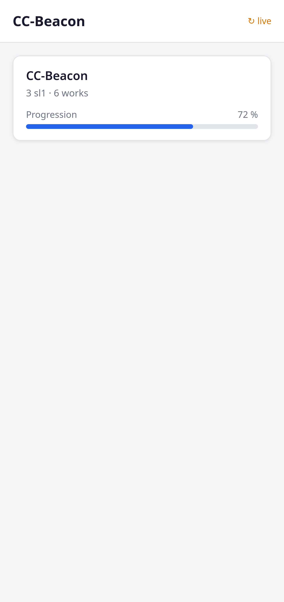
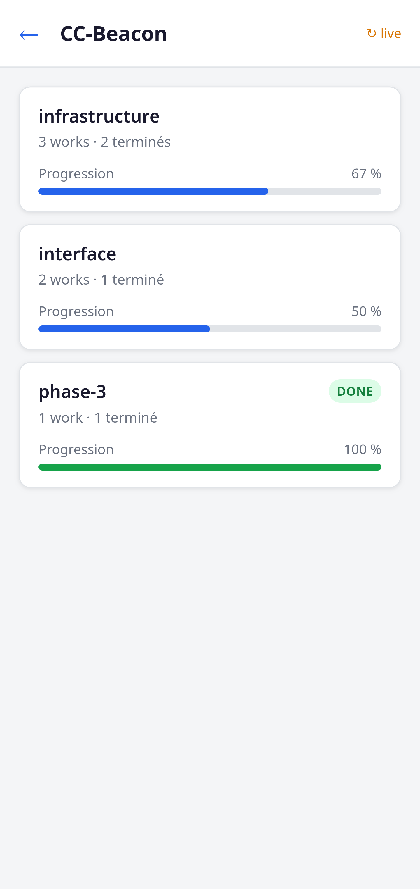
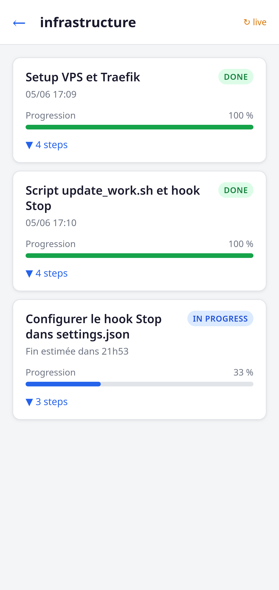
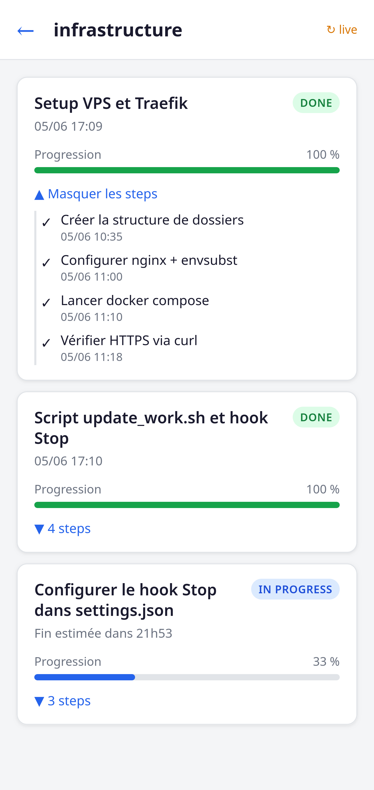
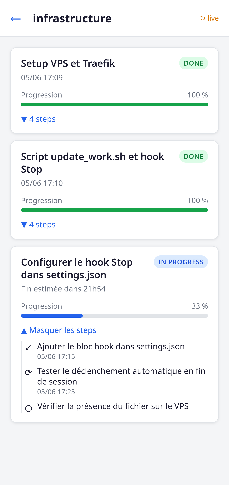

[🇫🇷 Version française](README.fr.md) | 🇬🇧 English version

---

# CC-Beacon

> *A lightweight Claude Code task tracker — structured JSON files deployed to a VPS via rsync, served behind Traefik, and readable from any smartphone.*


---

## Concept

Standard Claude Code sessions produce a stream of steps and decisions that are invisible once the terminal closes. **CC-Beacon** makes that work visible: every session writes a structured JSON file (a *work*) describing its steps, status, and duration. Those files are pushed to a VPS and displayed through a mobile-first HTML page — no app, no backend framework, just static files and a token-protected URL saved as a bookmark.

The tracking hierarchy is intentionally flat:

```
project
└── sl1  (label is configurable: "module", "feature", "component"…)
    └── work
        └── steps
```

---

## 📸 Screenshots

### Projects view

[](docs/screenshots/projects.png)

### SL1 view — Modules within a project

[](docs/screenshots/sl1.png)

### Works view — All works collapsed

[](docs/screenshots/works.png)

### Works view — Done work expanded

[](docs/screenshots/work-done.png)

### Works view — In progress work expanded

[](docs/screenshots/work-in-progress.png)

---

## How it works

1. **Claude Code hook** — a `Stop` hook in `~/.claude/settings.json` calls `scripts/update_work.sh --sync-only` at the end of each session
2. **rsync over SSH** — the script pushes the work JSON files and a regenerated index to the VPS
3. **nginx + Traefik** — static files are served under a secret token path (`/TOKEN/`), behind a Traefik reverse proxy with automatic TLS; the token is injected at container start via `envsubst`
4. **Mobile interface** — `web/index.html` fetches the index and renders project/sl1/work views with pagination and auto-refresh when a work is `in_progress`
5. **CI/CD deploy** — pushing to `main` triggers `.github/workflows/deploy.yml`, which fetches `web/index.html`, `ops/default.conf.template` and `docker-compose.prod.yml` from GitHub at the exact commit SHA and applies them on the VPS

---

## Progress calculation

**Work** — `steps done / steps total`

**SL1**
- Phase 1 (fewer than 2 completed works on this sl1): `works done / works total`
- Phase 2 (2 or more completed works): weighted by rolling average duration
  - Weight of each work = its actual duration (`started_at` → `updated_at`)
  - Estimated duration of remaining works = average of completed works on this sl1
  - Formula: `Σ duration of completed works / Σ estimated duration of all works`

**Project** — simple average of all sl1 progress values

---

## Data structure

### Work file (one per session)

```json
{
  "id": "2026-06-03T10-00-00",
  "project": "project-name",
  "sl1": "sl1-name",
  "title": "…",
  "status": "pending | in_progress | done | error",
  "started_at": "2026-06-03T10:00:00Z",
  "updated_at": "2026-06-03T10:42:00Z",
  "completion_time": "2026-06-03T10:42:00Z",
  "steps": [
    { "label": "…", "status": "pending | in_progress | done", "at": "…" }
  ],
  "summary": "free text"
}
```

`completion_time` is set once when the work first transitions to `done` and never overwritten.

### Index file (regenerated on every update)

```json
{
  "works": [
    {
      "id": "…",
      "project": "…",
      "sl1": "…",
      "title": "…",
      "status": "…",
      "started_at": "…",
      "updated_at": "…",
      "completion_time": "…",
      "step_count": 4,
      "steps_done": 3
    }
  ],
  "page": 1,
  "per_page": 10,
  "total": 24
}
```

---

## Project structure

```
~/projets/CC-Beacon/          ← this repo
├── .github/
│   └── workflows/
│       └── deploy.yml        ← CI/CD: deploys to VPS on push to main
├── docs/
│   └── ai/                   ← AI working notes (gitignored)
├── ops/
│   ├── compose.env.example   ← template for compose/.env on the VPS
│   └── default.conf.template ← nginx config, token injected via envsubst
├── scripts/
│   └── update_work.sh        ← rsync deployment script
├── web/
│   └── index.html            ← mobile interface
├── docker-compose.prod.yml   ← nginx container + Traefik labels (prod)
├── config.example.json       ← versioned template (no sensitive values)
├── .gitignore
└── README.md

~/.CC-Beacon/                 ← outside the repo, never committed
├── config.json               ← real values: VPS host, SSH user, token, etc.
└── works/                    ← local work files synced to VPS
    ├── index.json
    └── <id>.json
```

---

## Configuration

`config.example.json` is the versioned template. Copy it to `~/.CC-Beacon/config.json` and fill in the real values.

```json
{
  "vps_host": "your-vps-hostname-or-ip",
  "vps_user": "your-ssh-user",
  "remote_path": "/var/www/CC-Beacon/works/",
  "token": "your-secret-token",
  "base_url": "https://beacon.your-domain.com",
  "sl1_label": "module"
}
```

`~/.CC-Beacon/` is excluded from the repo via `.gitignore`.

---

## VPS setup

```
~/your-traefik-basedir/cc-beacon/
├── compose/
│   ├── docker-compose.yml          ← copy of docker-compose.prod.yml
│   └── .env                        ← DOMAIN=your-domain.com (never committed)
└── shared/
    ├── env/
    │   └── secrets.env             ← TOKEN=your-secret-token (never committed)
    ├── nginx/
    │   └── default.conf.template   ← copy of ops/default.conf.template
    └── www/
        ├── index.html              ← copy of web/index.html
        └── works/                  ← rsync target
```

**Two separate env files, two separate purposes:**
- `compose/.env` — read by `docker compose` at startup for label interpolation (`${DOMAIN}` in Traefik labels). See `ops/compose.env.example` for the template.
- `shared/env/secrets.env` — passed to the nginx container at runtime; `${TOKEN}` is substituted into `default.conf.template` via `envsubst`.

Neither file is ever committed.

Generate a token with:
```bash
openssl rand -hex 24
```

Start the container:
```bash
cd ~/your-traefik-basedir/cc-beacon/compose && docker compose up -d
```

---

## Claude Code integration

Add the following hook to `~/.claude/settings.json` so the script syncs automatically at the end of each Claude Code session:

```json
{
  "hooks": {
    "Stop": [
      {
        "matcher": "",
        "hooks": [
          {
            "type": "command",
            "command": "~/projets/CC-Beacon/scripts/update_work.sh --sync-only"
          }
        ]
      }
    ]
  }
}
```

The `--sync-only` flag skips file creation and runs rsync only — it acts as a safety net. During the session, call the script explicitly with full arguments to create and update the work file.

---

## Interface

`web/index.html` is a single-file mobile-first app (vanilla HTML/CSS/JS, no build step):

| View | Description |
|------|-------------|
| **Projects** | List of projects with aggregated progress bar |
| **SL1** | List of sl1 entries for a project, with weighted progress |
| **Works** | Paginated list of works for an sl1, with step detail on tap |

- Done works show: `Completed on DD/MM HH:mm · X min`
- In-progress works with steps done show: `Estimated end in X min`
- In-progress works with no steps done show: `Running for X min`
- When any work has `status: in_progress`, the page automatically refreshes every 30 seconds

---

## Roadmap

- [x] **Phase 1** — Repository structure and file contents
- [x] **Phase 2** — VPS setup: nginx config, Traefik labels, directory structure
- [x] **Phase 3** — Scripts and hooks: `config.example.json`, `update_work.sh`, `settings.json` hook
- [x] **Phase 4** — Mobile interface: `web/index.html`
- [x] **Phase 5** — CLAUDE.md section describing CC-Beacon for future sessions

---

## License

This project is licensed under the MIT License — see the [LICENSE](LICENSE) file for details.
