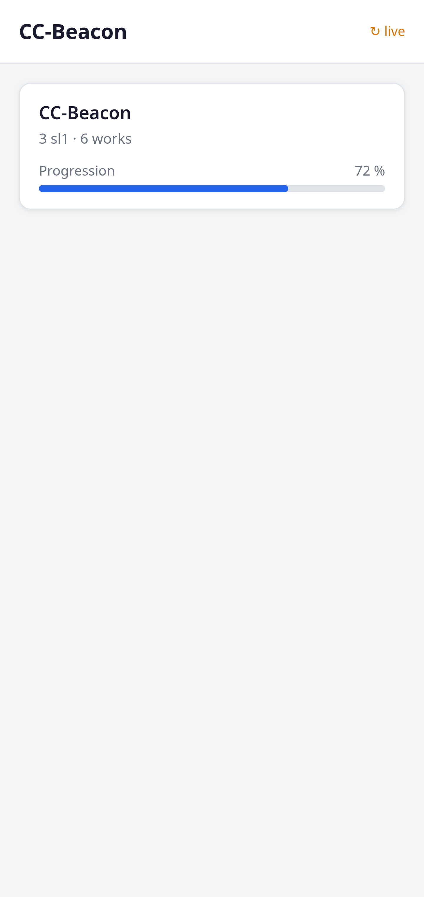
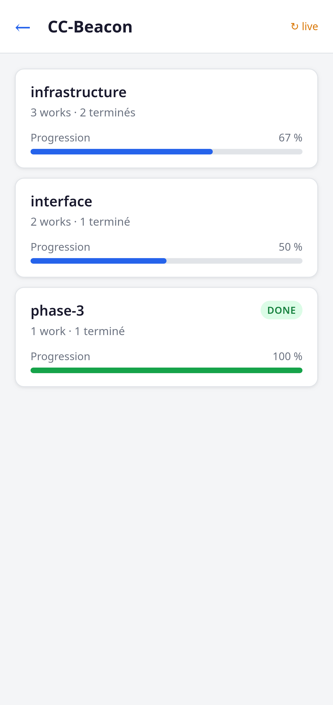
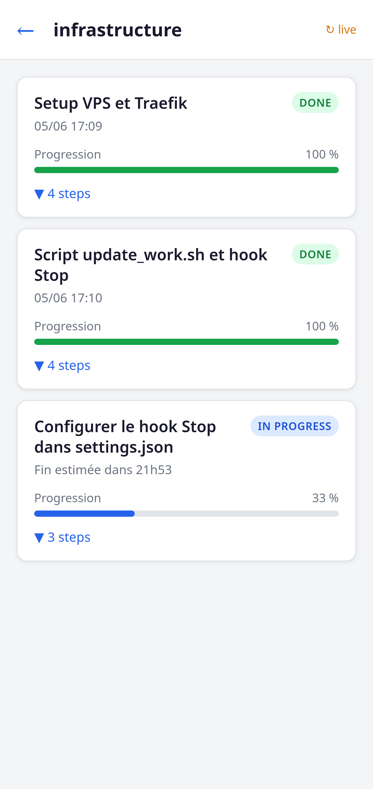
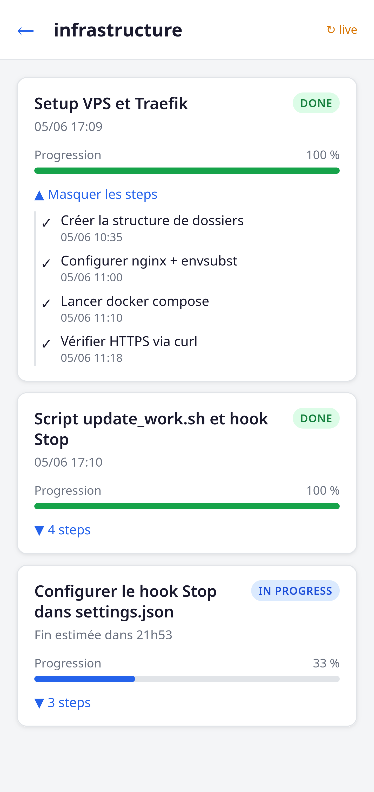
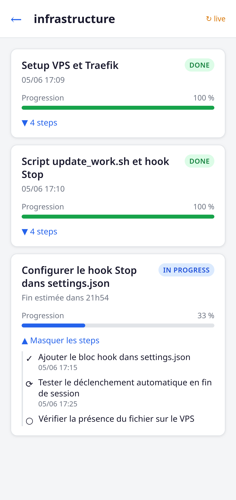

[🇫🇷 Version française](README.fr.md) | 🇬🇧 English version

---

# CC-Beacon

> *A lightweight Claude Code task tracker — a FastAPI service on a VPS storing structured JSON files, served behind Traefik, and readable from any smartphone.*


[](https://github.com/MarvinLeRouge/CC-Beacon/actions/workflows/ci.yml)
[](https://github.com/MarvinLeRouge/CC-Beacon/actions/workflows/build-push.yml)


---

## Concept

Standard Claude Code sessions produce a stream of steps and decisions that are invisible once the terminal closes. **CC-Beacon** makes that work visible: every session writes a structured JSON file (a *work*) describing its steps, status, and duration, pushed over HTTP to a small FastAPI service. The API is the single source of truth — it stores the data, computes the index, and serves the mobile interface itself, behind a Bearer-token-protected API and a bookmarkable URL.

The tracking hierarchy is intentionally flat:

```
project
└── sl1  (label is configurable: "module", "feature", "component"…)
    └── work
        └── steps
```

---

## 📸 Screenshots

### Projects view

[](docs/screenshots/projects.png)

### SL1 view — Modules within a project

[](docs/screenshots/sl1.png)

### Works view — All works collapsed

[](docs/screenshots/works.png)

### Works view — Done work expanded

[](docs/screenshots/work-done.png)

### Works view — In progress work expanded

[](docs/screenshots/work-in-progress.png)

---

## How it works

1. **Claude Code hook** — a `Stop` hook in `~/.claude/settings.json` calls `scripts/update_work.sh --sync-only` at the end of each session
2. **HTTP client** — the script pushes work updates to the API (`POST /api/work`) and caches the returned index locally; no SSH, no rsync
3. **FastAPI + Traefik** — a single container serves the mobile interface (`GET /`, `GET /app.js`) and the REST API (`/api/*`, protected by `Authorization: Bearer`), behind a Traefik reverse proxy with automatic TLS
4. **Mobile interface** — `web/index.html` + `web/app.js` call the API and render project/sl1/work views with pagination, deletion, and auto-refresh when a work is `in_progress`
5. **CI/CD deploy** — pushing to `main` triggers `.github/workflows/ci.yml` (ruff, mypy, pytest); on success, `.github/workflows/build-push.yml` builds the API image, pushes it to GHCR, and deploys it to the VPS over SSH

---

## Progress calculation

**Work** — `steps done / steps total`

**SL1**
- Phase 1 (fewer than 2 completed works on this sl1): `works done / works total`
- Phase 2 (2 or more completed works): weighted by rolling average duration
  - Weight of each work = its actual duration (`started_at` → `updated_at`)
  - Estimated duration of remaining works = average of completed works on this sl1
  - Formula: `Σ duration of completed works / Σ estimated duration of all works`

**Project** — simple average of all sl1 progress values

---

## Data structure

### Work file (one per session)

```json
{
  "id": "2026-06-03T10-00-00",
  "project": "project-name",
  "sl1": "sl1-name",
  "title": "…",
  "status": "pending | in_progress | done | error",
  "started_at": "2026-06-03T10:00:00Z",
  "updated_at": "2026-06-03T10:42:00Z",
  "completion_time": "2026-06-03T10:42:00Z",
  "steps": [
    { "label": "…", "status": "pending | in_progress | done", "at": "…" }
  ],
  "summary": "free text"
}
```

`completion_time` is set once when the work first transitions to `done` and never overwritten.

### Index (computed on demand by `GET /api/index` from every work file — never persisted separately)

```json
{
  "works": [
    {
      "id": "…",
      "project": "…",
      "sl1": "…",
      "title": "…",
      "status": "…",
      "started_at": "…",
      "updated_at": "…",
      "completion_time": "…",
      "step_count": 4,
      "steps_done": 3
    }
  ],
  "page": 1,
  "per_page": 10,
  "total": 24
}
```

---

## Project structure

```
~/projets/CC-Beacon/          ← this repo
├── .github/
│   └── workflows/
│       ├── ci.yml             ← lint, type-check and test the API on every push/PR
│       └── build-push.yml     ← builds and pushes the API image to GHCR, deploys over SSH
├── api/
│   ├── main.py                ← FastAPI app: serves index.html/app.js, security headers, /healthz
│   ├── auth.py                ← Bearer token dependency
│   ├── models.py               ← Pydantic models
│   ├── routes.py                ← /api/* endpoints
│   ├── storage.py                ← JSON file storage, index computed on the fly
│   ├── tests/                     ← pytest suite
│   ├── Dockerfile
│   └── requirements*.txt, pyproject.toml
├── docs/
│   └── ai/                   ← AI working notes (gitignored)
├── ops/
│   └── compose.env.example   ← template for compose/.env on the VPS
├── scripts/
│   └── update_work.sh        ← HTTP client for the API
├── web/
│   ├── index.html            ← mobile interface (HTML + CSS)
│   └── app.js                ← application logic
├── docker-compose.prod.yml   ← api container + Traefik labels (prod)
├── config.example.json       ← versioned template (no sensitive values)
├── .pre-commit-config.yaml
├── .gitignore
└── README.md

~/.CC-Beacon/                 ← outside the repo, never committed
├── config.json               ← real values: base_url, token
└── works/
    └── index.json             ← local cache of the API's index (not a source of truth)
```

---

## Configuration

`config.example.json` is the versioned template. Copy it to `~/.CC-Beacon/config.json` and fill in the real values.

```json
{
  "token": "your-secret-token",
  "base_url": "https://beacon.your-domain.com",
  "sl1_label": "module"
}
```

`~/.CC-Beacon/` is excluded from the repo via `.gitignore`.

---

## VPS setup

```
~/your-traefik-basedir/cc-beacon/
├── compose/
│   ├── docker-compose.yml          ← copy of docker-compose.prod.yml
│   └── .env                        ← DOMAIN=your-domain.com (never committed)
└── shared/
    ├── env/
    │   └── secrets.env             ← TOKEN=your-secret-token (never committed)
    └── data/
        └── works/                  ← the API's persistent storage (one JSON file per work)
```

**Two separate env files, two separate purposes:**
- `compose/.env` — read by `docker compose` at startup for label interpolation (`${DOMAIN}` in Traefik labels). See `ops/compose.env.example` for the template.
- `shared/env/secrets.env` — passed to the `api` container as `TOKEN`, read directly by the FastAPI app.

Neither file is ever committed.

Generate a token with:
```bash
openssl rand -hex 24
```

Start the container:
```bash
cd ~/your-traefik-basedir/cc-beacon/compose && docker compose pull && docker compose up -d
```

---

## Claude Code integration

Add the following hook to `~/.claude/settings.json` so the script syncs automatically at the end of each Claude Code session:

```json
{
  "hooks": {
    "Stop": [
      {
        "matcher": "",
        "hooks": [
          {
            "type": "command",
            "command": "~/projets/CC-Beacon/scripts/update_work.sh --sync-only"
          }
        ]
      }
    ]
  }
}
```

The `--sync-only` flag skips file creation and runs rsync only — it acts as a safety net. During the session, call the script explicitly with full arguments to create and update the work file.

---

## Interface

`web/index.html` + `web/app.js` form a mobile-first app (vanilla HTML/CSS/JS, no build step), served directly by the API. Dark mode is supported via `prefers-color-scheme: dark`. Access is gated by a token entered once per device — cached in `localStorage`, never carried in a URL — and sent as `Authorization: Bearer` on every API call.

| View | Description |
|------|-------------|
| **Projects** | List of projects with aggregated progress bar |
| **SL1** | List of sl1 entries for a project, with weighted progress |
| **Works** | Paginated list of works for an sl1, with step detail on tap |

- Done works show: `Completed on DD/MM HH:mm · X min`
- In-progress works with steps done show: `Estimated end in X min`
- In-progress works with no steps done show: `Running for X min`
- When any work has `status: in_progress`, the page automatically refreshes every 30 seconds
- Projects and sl1 entries can be deleted from their list view (confirmation required, cannot be undone)

---

## Roadmap

- [x] **Phase 1** — Repository structure and file contents
- [x] **Phase 2** — VPS setup: nginx config, Traefik labels, directory structure
- [x] **Phase 3** — Scripts and hooks: `config.example.json`, `update_work.sh`, `settings.json` hook
- [x] **Phase 4** — Mobile interface: `web/index.html`
- [x] **Phase 5** — CLAUDE.md section describing CC-Beacon for future sessions
- [x] **Phase 6** — Traefik harmonization, prod deployment fix, automated CI/CD deploy via GitHub Actions
- [x] **Phase 7** — Mobile interface improvements: dark mode, WCAG AA contrast, accessible tap targets, unified font scale
- [x] **Phase 8** — Security hardening: JS extracted to `app.js` for strict CSP, `badge()` XSS fix, token removed from error messages, security headers (CSP, X-Content-Type-Options, X-Frame-Options, Referrer-Policy)

---

## License

This project is licensed under the MIT License — see the [LICENSE](LICENSE) file for details.
